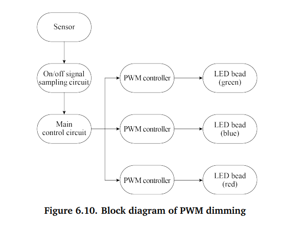

# wifi-glow
smart-light build using esp-idf and ESP32-C3 IC, with custom LED control driver

### Purpose 

This project is a pilot project to getting up to speed with ESP-IDF development framework,   

using ESP32-C3 development IC.

It features hardware design from scratch, using inbuilt ESP32-C3 features, e.g LED PWM control, GPIO Multiplexing etc.

### Color space 

LED lights use RGB color space as the brightness of red, green and blue are adjusted to generate various colors. However, the user interface and control commands use the HSV and HSL color space.   

Therefore the LED driver needs to convert values from the HSV or HSL dimension to the RGB dimension, so as to get the expected LED color.

### Led Dimming 

There are 2 LED dimming methods:

- TRIAC dimming

 Waveform of the input voltage changes with the conductions angle of the TRIAC. Suitable for incandescent lamps and fluorescent lamps

- PWM dimming

Sending PWM signals and changing their frequency and duty cycle 

- I2C dimming

Uses ICs that receive signals via I2C and adjust the current of multiple independent output interfaces to dim the LED.

PWM dimming performs the best by guaranteeing stability and brightness even at low power levels.

Block diagram of PWM dimming

PWM has only 3 parameters:

- Period
- Frequency
- Duty cycle 

#### How PWM controls LEDs

When using PWM to control an LED, if the light is turned on for 1 second and then off for 1 second repeatedly (i.e., period = 2s, duty cycle = 50%), the LED will appear to blink.  

 If this cycle is shortened to 200 ms, with the LED being on for 100 ms and then off for 100 ms, the LED will appear to blink at a higher frequency.    

Due to the persistence of vision, as the cycle continues decreasing, there will be a critical threshold where the human eye cannot perceive the blinking of the LED.   

At this point, the persistence of vision blends the on and off images, resulting in a stable average brightness  

### Driver development

A custom driver is written to be able to control the RGB, Warm white(WW) and Cool white(CW) LED systems.  Also, Wi-Fi control is implemented to be able to control the smart LED light remotely. 

### Driver development

A custom driver is written to be able to control the RGB, Warm white(WW) and Cool white(CW) LED systems.  Also, Wi-Fi control is implemented to be able to control the smart LED light remotely. 

Practically, it is expected that the light bulb will maintain its color, brightness and color temperature consistent with its previous status when turning on. This means we need to preserve the light's status when it is turned off. To achieve this we use the Non-Volatile Storage(NVS) feature of the ESP32.

#### 1. NVS

Stores persistent data even on power failure. Suitable for storing small data. In IOT projects, it is best to store the user data that does not frequently change. 

- Key-value pairs - nvs operates on "key:value" pairs. 
- Namespaces -To separate and avoid potential conflicts between key:value pairs.

Note: If the device is powered off DURING writing a specific key:value pair, that specific key value pair will be lost.

## References

1.  ESP32-C3 Wifi Development Handbook
